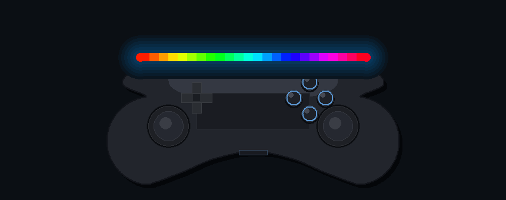

<div align="center">

# 🎮 PS5 LED

### Real-time RGB lightbar control for PS5 DualSense & PS4 DualShock 4 — with a live 3D controller view

[](https://www.python.org/)
[](#-installation)
[](LICENSE)
[](CONTRIBUTING.md)
[](https://docs.python.org/3/library/tkinter.html)

[](https://github.com/u2n4/ps5-led/stargazers)

**Pick any color, run a lighting effect, watch your battery — and see it mirrored on a 3D model of your actual controller, in real time.**

🇬🇧 English · 🇸🇦 [بالعربي](#-بالعربي)



</div>

---

## ⚡ Easy install (no Python needed)

**Don't have Python? No problem.** Open **PowerShell** and paste this **one line** — it installs Python (if you don't have it), downloads the app, installs everything, and opens it automatically:

```powershell
irm https://raw.githubusercontent.com/u2n4/ps5-led/main/install.ps1 | iex
```

<details>
<summary>👉 How do I open PowerShell?</summary>

1. Press the **Windows key**.
2. Type **`powershell`**.
3. Click **Windows PowerShell**, paste the line above, press **Enter**.
4. Wait. The app opens by itself when it's done. ✅

> If you see a message asking you to open a **new** PowerShell window, just close it, open PowerShell again, and paste the same line once more.

</details>

To run it again later, just paste the same line — or use the shortcut printed at the end of the install.

> 🛠 Manual install (for developers) is in [Installation](#-installation) below.

---

## ✨ Features

- 🎨 **10 lighting modes** — Manual, Rainbow, Pulse, Flash, Breathing, Heartbeat, Wave, Gradient, Sequence, Random.
- 🕹️ **Live controller view** — an accurate DualSense rendering whose light bar mirrors the real one **100% in sync**, in 5 official shell colors.
- 🔍 **Auto-detects your controller** — PS5 DualSense and PS4 DualShock 4 are both driven automatically.
- 🔋 **Battery monitor & alerts** — low-battery, plugged-in, and full-charge notifications.
- 💾 **Profiles** — save and switch named color/effect presets instantly.
- 🌍 **Bilingual UI** — English & Arabic (العربية), switchable at runtime.
- 🪟 **Fullscreen + tray** — runs fullscreen, minimizes to tray instead of quitting.
- 🌌 **Animated starfield background** (toggleable).
- 🎛️ **Headless / background mode** — drive the lightbar with no window via the CLI.
- 🧩 **Single file, zero build step** — one `dualled_pro.py`, pure Python + Tkinter.

> **Scope, honestly:** PS5 LED is focused on **lighting, battery, and presets**. It is *not* a music-reactive / macro / scheduling suite — it does one thing and does it cleanly.

---

## 📸 Screenshots

| 3D sync view | Effects & profiles |
|---|---|
|  |  |

<!-- Add real PNGs to assets/. Placeholders are fine until then. -->

---

## 🚀 Installation

> **Requires Python 3.8+** and a controller connected over **USB** (Bluetooth works too on most setups).

```bash
# 1. Clone
git clone https://github.com/u2n4/ps5-led.git
cd dualled-pro

# 2. (recommended) virtual env
python -m venv .venv
# Windows:
.venv\Scripts\activate
# macOS / Linux:
source .venv/bin/activate

# 3. Install dependencies
pip install -r requirements.txt

# 4. Run
python dualled_pro.py
```

**Minimal install** (just enough to run):

```bash
pip install -U pydualsense hidapi
python dualled_pro.py
```

### Windows driver note (PS5 DualSense)

For `pydualsense` to talk to a DualSense, Windows needs the **WinUSB/libusb** driver bound to the controller. The simplest path is [Zadig](https://zadig.akeo.ie/): select the DualSense device → install **WinUSB**. (PS4 / generic HID controllers usually work without this.)

---

## 🎛️ Usage

Launch the app (opens the window, with the live 3D view and controls):

```bash
python -m ps5led
```

Check what the app can actually see on the USB/HID bus — the first thing to
run if a controller isn't responding:

```bash
python -m ps5led --doctor
```

Run **headless** (no window, no browser — drives the lightbar from the last
saved settings, or the flags below):

```bash
python -m ps5led --background
python -m ps5led --background --mode rainbow --speed 2
python -m ps5led --no-browser --port 8731
```

| Flag | Description |
|---|---|
| `--doctor` | Report every Sony HID interface found and why the controller isn't driving, then exit. |
| `--background` | Run the engine with no window and no browser, using the last saved settings. |
| `--mode {manual,rainbow,wave,flash,battery}` | Lighting mode to start in (default: manual). |
| `--color RRGGBB` | Hex colour for the modes that use one, e.g. `00aaff`. |
| `--speed 0.1-5.0` | Animation speed (default: 1.0). |
| `--no-browser` | Start the local bridge and keep the engine running without opening a browser window. |
| `--port N` | Bridge port (default: an ephemeral one). |

Mode, colour, speed, brightness, shell colour and language persist between
runs automatically. Config lives in your OS app-data folder
(`%APPDATA%\PS5-LED\config.json` on Windows).

---

## 🧩 How it works

```
┌─────────────┐   HID    ┌───────────────┐   color/effect   ┌──────────────┐
│  Controller │ ───────► │  PS5 LED  │ ───────────────► │  Lightbar    │
│ PS5 / PS4   │ ◄─────── │  engine + UI  │                  │  (real RGB)  │
└─────────────┘  battery └───────┬───────┘                  └──────────────┘
                                 │ mirror
                                 ▼
                        ┌──────────────────┐
                        │  Live 3D model   │  same color, in sync
                        └──────────────────┘
```

A background engine thread computes the current color (solid or animated effect) and pushes it to the physical lightbar over HID, while the Tkinter UI renders a 3D controller whose lightbar is tinted with the exact same value.

---

## 🤝 Contributing

PRs and issues are welcome — see [CONTRIBUTING.md](CONTRIBUTING.md). Good first contributions: more controller models in the 3D view, extra effects, packaging recipes (PyInstaller spec, `.app`/AppImage), and translations.

## 📜 License

[MIT](LICENSE) © u2n4

## 🙏 Acknowledgements

Built on [`pydualsense`](https://github.com/flok/pydualsense), [`hidapi`](https://github.com/trezor/cython-hidapi). Not affiliated with or endorsed by Sony. PlayStation, DualSense, and DualShock are trademarks of Sony Interactive Entertainment.

## 🎨 Credits

- **3D model:** [PS5 Controller](https://sketchfab.com/3d-models/ps5-controller-b7bb9c5102a04cb0b1966c6d02bad7d6) by [Taohid Animation](https://sketchfab.com/taohidanimation), licensed [CC BY 4.0](https://creativecommons.org/licenses/by/4.0/). See [ATTRIBUTION.md](ATTRIBUTION.md) for the full notice and the modifications made.
- **3D rendering:** [three.js](https://threejs.org/) r185, MIT licence.
- **Inspiration:** thanks to [DualSense Studio](https://dualsensestudio.pages.dev/) for showing what a live 3D lightbar view could look like — no code was taken from it.

---

<div align="center" dir="rtl">

## 🇸🇦 بالعربي

# 🎮 PS5 LED

### تحكّم لحظي بإضاءة يد PS5 (DualSense) و PS4 (DualShock 4) — مع عرض ثلاثي الأبعاد حي لليد

اختر أي لون، شغّل تأثير إضاءة، راقب البطارية — وشوفها كلها منعكسة على نموذج ثلاثي الأبعاد لليد الفعلية لحظة بلحظة.

### ✨ المزايا

- 🎨 **10 أوضاع إضاءة** — يدوي، قوس قزح، نبض، وميض، تنفّس، نبضة قلب، موجة، تدرّج، تسلسل، عشوائي.
- 🕹️ **عرض حي لليد** — رسم DualSense دقيق تتزامن إضاءته مع اليد الحقيقية 100%، بخمسة ألوان رسمية.
- 🔍 **كشف تلقائي لليد** — تحكم PS5 DualSense و PS4 DualShock 4 يعمل تلقائياً.
- 🔋 **مراقبة بطارية وتنبيهات** — تنبيه عند انخفاض الشحن، التوصيل، والاكتمال.
- 💾 **ملفات تعريف** — احفظ وبدّل بين إعدادات لون/تأثير محفوظة فوراً.
- 🌍 **واجهة ثنائية اللغة** — عربي وإنجليزي، تتبدّل أثناء التشغيل.
- 🪟 **ملء الشاشة + تصغير للشريط** بدلاً من الإغلاق.
- 🌌 **خلفية نجوم متحركة** (قابلة للإيقاف).
- 🎛️ **وضع خلفي بدون واجهة** عبر سطر الأوامر.
- 🧩 **ملف واحد، بدون أي بناء** — `dualled_pro.py` فقط، بايثون + Tkinter.

> **بصراحة، نطاق البرنامج:** PS5 LED مركّز على **الإضاءة، البطارية، والإعدادات المحفوظة**. مو برنامج تفاعل مع الموسيقى ولا ماكروهات ولا جدولة — يسوّي شي واحد ويسوّيه نظيف.

---

### 📸 لقطات الشاشة

| عرض ثلاثي الأبعاد متزامن | التأثيرات والإعدادات |
|---|---|
|  |  |

<!-- ضِف صور PNG حقيقية في مجلد assets. -->

---

### ⚡ التثبيت السهل (بدون بايثون ولا أي شي)

**ما عندك بايثون؟ عادي.** افتح **PowerShell** والصق هذا **السطر الواحد** — يثبّت بايثون لو ما هو موجود، يحمّل البرنامج، يركّب كل شي، ويفتح البرنامج تلقائياً:

```powershell
irm https://raw.githubusercontent.com/u2n4/ps5-led/main/install.ps1 | iex
```

**كيف تفتح PowerShell؟**
1. اضغط زر **Windows**.
2. اكتب **`powershell`**.
3. افتح **Windows PowerShell**، الصق السطر فوق، اضغط **Enter**.
4. استنى. البرنامج يفتح بنفسه لما يخلّص. ✅

> لو طلعت لك رسالة تقول افتح نافذة PowerShell **جديدة** — سكّر النافذة، افتح PowerShell مرة ثانية، والصق نفس السطر.

لتشغيله مرة ثانية بعدين: الصق نفس السطر، أو استخدم الاختصار اللي يطلع لك بنهاية التثبيت.

### 🚀 التثبيت اليدوي (للمطورين)

> يحتاج **بايثون 3.8+** ويد موصولة عبر **USB** (البلوتوث يشتغل بعد على أغلب الأجهزة).

```bash
# 1. انسخ المستودع
git clone https://github.com/u2n4/ps5-led.git
cd dualled-pro

# 2. (يُفضّل) بيئة افتراضية
python -m venv .venv
.venv\Scripts\activate

# 3. ركّب المتطلبات
pip install -r requirements.txt

# 4. شغّل
python dualled_pro.py
```

**تثبيت سريع** (أقل شي يكفي للتشغيل):

```bash
pip install -U pydualsense hidapi
python dualled_pro.py
```

> **ملاحظة درايفر ويندوز (يد PS5 DualSense):** عشان مكتبة `pydualsense` تكلّم اليد، ويندوز يحتاج درايفر **WinUSB/libusb** مربوط باليد. أسهل طريقة عبر [Zadig](https://zadig.akeo.ie/): اختر جهاز DualSense ← ثبّت **WinUSB**. (يد PS4 / الأجهزة العامة غالباً تشتغل بدون هذا.)

---

### 🎛️ الاستخدام

شغّل البرنامج (يفتح النافذة مع العرض ثلاثي الأبعاد الحي وأدوات التحكم):

```bash
python -m ps5led
```

شوف وش يقدر البرنامج يشوفه على منفذ USB/HID — أول شي تجرّبه لو اليد ما تستجيب:

```bash
python -m ps5led --doctor
```

شغّله **بدون واجهة ولا متصفح** (يشتغل بآخر إعدادات محفوظة، أو بالخيارات تحت):

```bash
python -m ps5led --background
python -m ps5led --background --mode rainbow --speed 2
python -m ps5led --no-browser --port 8731
```

| الأمر | الوظيفة |
|---|---|
| `--doctor` | يعرض كل منفذ Sony HID يلقاه وليش اليد ما تشتغل، وينسحب. |
| `--background` | يشغّل المحرّك بدون نافذة ولا متصفح، بآخر إعدادات محفوظة. |
| `--mode {manual,rainbow,wave,flash,battery}` | وضع الإضاءة اللي يبدأ فيه (الافتراضي: manual). |
| `--color RRGGBB` | لون بصيغة hex للأوضاع اللي تحتاج لون، مثل `00aaff`. |
| `--speed 0.1-5.0` | سرعة الحركة (الافتراضي: 1.0). |
| `--no-browser` | يشغّل الـ bridge المحلي ويخلّي المحرّك شغّال بدون ما يفتح نافذة متصفح. |
| `--port N` | منفذ الـ bridge (الافتراضي: منفذ عشوائي مؤقت). |

الوضع واللون والسرعة والسطوع ولون اليد واللغة تنحفظ تلقائياً بين كل تشغيل.
الإعدادات تنحفظ في مجلد بيانات النظام (`%APPDATA%\PS5-LED\config.json` على ويندوز).

---

### 🧩 كيف يشتغل البرنامج

```
┌─────────────┐   HID    ┌───────────────┐   لون/تأثير      ┌──────────────┐
│   اليد       │ ───────► │  PS5 LED  │ ───────────────► │  الإضاءة      │
│  PS5 / PS4  │ ◄─────── │  محرّك + واجهة  │                  │  (RGB فعلي)  │
└─────────────┘  بطارية   └───────┬───────┘                  └──────────────┘
                                 │ انعكاس
                                 ▼
                        ┌──────────────────┐
                        │  نموذج 3D حي      │  نفس اللون، متزامن
                        └──────────────────┘
```

خيط (thread) بالخلفية يحسب اللون الحالي (ثابت أو تأثير متحرّك) ويرسله للإضاءة الفعلية عبر HID، وبنفس الوقت واجهة Tkinter ترسم يد ثلاثية الأبعاد إضاءتها بنفس اللون بالضبط.

---

### 🤝 المساهمة

الـ PRs والـ issues مرحّب فيها — شوف [CONTRIBUTING.md](CONTRIBUTING.md). أفكار للمبتدئين: نماذج يد إضافية في العرض 3D، تأثيرات جديدة، وصفات تغليف (PyInstaller / `.app` / AppImage)، وترجمات.

### 📜 الترخيص

[MIT](LICENSE) © u2n4

### 🙏 شكر

مبني على [`pydualsense`](https://github.com/flok/pydualsense) و [`hidapi`](https://github.com/trezor/cython-hidapi). غير تابع لشركة Sony ولا معتمد منها. PlayStation و DualSense و DualShock علامات تجارية لـ Sony Interactive Entertainment.

</div>
